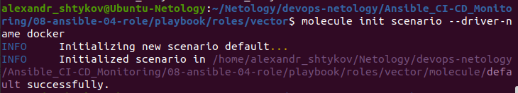
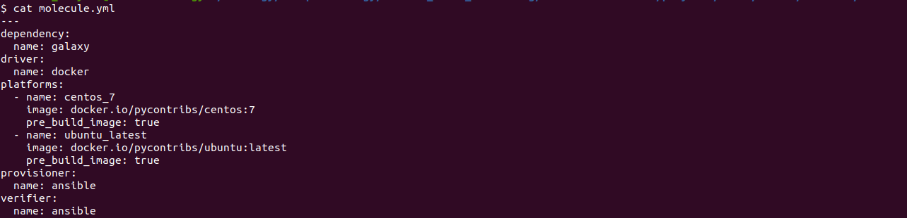
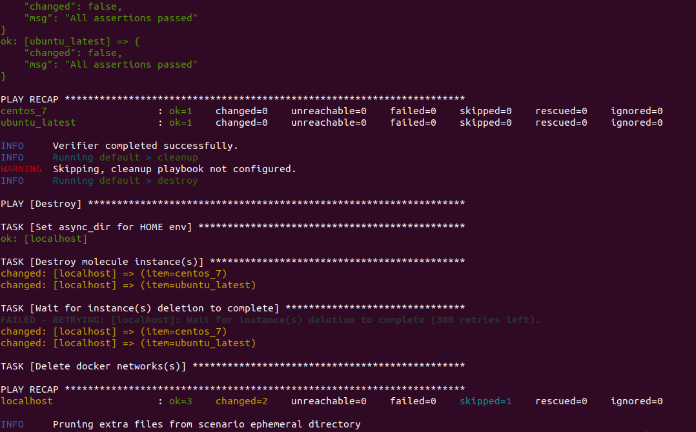
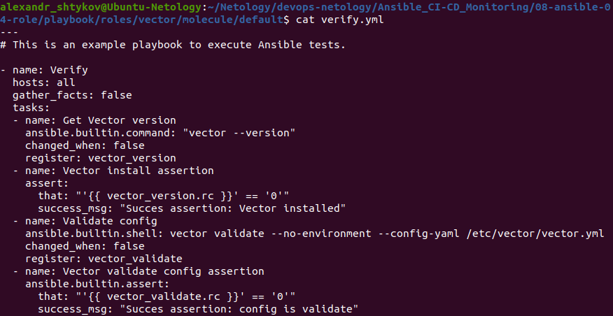
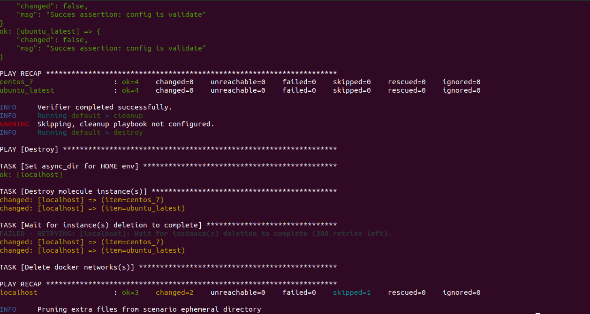
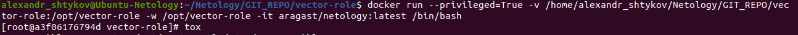
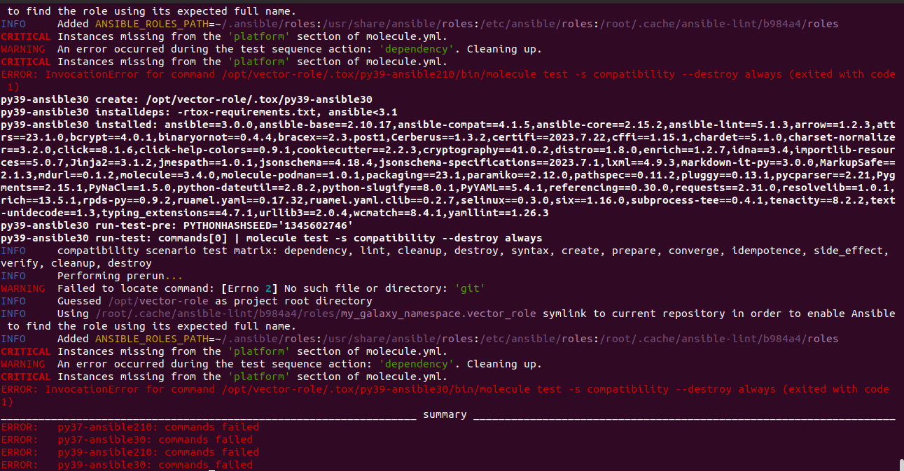
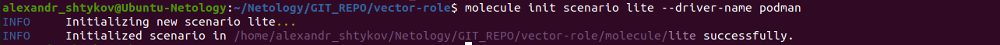
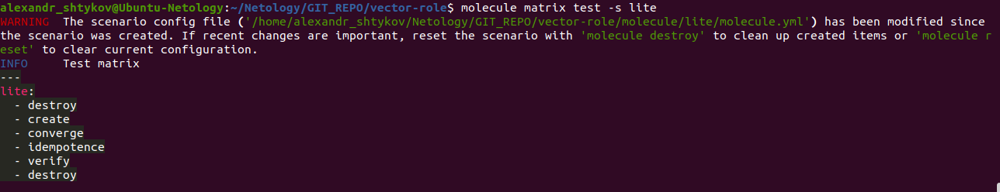
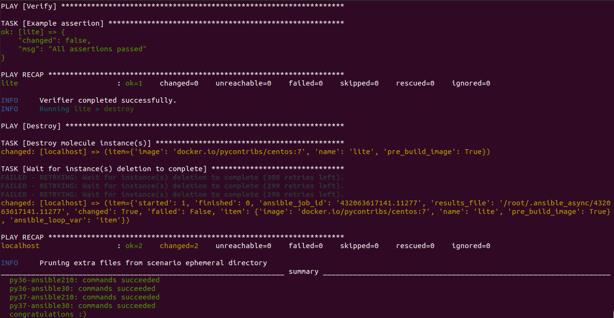

# Домашнее задание к занятию 5 «Тестирование roles»

## Подготовка к выполнению

1. Установите molecule: `pip3 install "molecule==3.5.2"`.
2. Выполните `docker pull aragast/netology:latest` —  это образ с podman, tox и несколькими пайтонами (3.7 и 3.9) внутри.

## Основная часть

Ваша цель — настроить тестирование ваших ролей. 

Задача — сделать сценарии тестирования для vector. 

Ожидаемый результат — все сценарии успешно проходят тестирование ролей.

### Molecule

1. Запустите  `molecule test -s centos_7` внутри корневой директории clickhouse-role, посмотрите на вывод команды. Данная команда может отработать с ошибками, это нормально. Наша цель - посмотреть как другие в реальном мире используют молекулу.
2. Перейдите в каталог с ролью vector-role и создайте сценарий тестирования по умолчанию при помощи `molecule init scenario --driver-name docker`.
<p align="center">
  
</p>
3. Добавьте несколько разных дистрибутивов (centos:8, ubuntu:latest) для инстансов и протестируйте роль, исправьте найденные ошибки, если они есть.
<p align="center">
  
</p>

<p align="center">
  
</p>

<details>

```
alexandr_shtykov@Ubuntu-Netology:~/Netology/devops-netology/Ansible_CI-CD_Monitoring/08-ansible-04-role/playbook/roles/vector$ molecule test
INFO     default scenario test matrix: dependency, lint, cleanup, destroy, syntax, create, prepare, converge, idempotence, side_effect, verify, cleanup, destroy
INFO     Performing prerun with role_name_check=0...
INFO     Set ANSIBLE_LIBRARY=/home/alexandr_shtykov/.cache/ansible-compat/b0d51c/modules:/home/alexandr_shtykov/.ansible/plugins/modules:/usr/share/ansible/plugins/modules
INFO     Set ANSIBLE_COLLECTIONS_PATH=/home/alexandr_shtykov/.cache/ansible-compat/b0d51c/collections:/home/alexandr_shtykov/.ansible/collections:/usr/share/ansible/collections
INFO     Set ANSIBLE_ROLES_PATH=/home/alexandr_shtykov/.cache/ansible-compat/b0d51c/roles:/home/alexandr_shtykov/.ansible/roles:/usr/share/ansible/roles:/etc/ansible/roles
INFO     Using /home/alexandr_shtykov/.cache/ansible-compat/b0d51c/roles/my_galaxy_namespace.vector_role symlink to current repository in order to enable Ansible to find the role using its expected full name.
INFO     Running default > dependency
WARNING  Skipping, missing the requirements file.
WARNING  Skipping, missing the requirements file.
INFO     Running default > lint
INFO     Lint is disabled.
INFO     Running default > cleanup
WARNING  Skipping, cleanup playbook not configured.
INFO     Running default > destroy
INFO     Sanity checks: 'docker'

PLAY [Destroy] *****************************************************************

TASK [Set async_dir for HOME env] **********************************************
ok: [localhost]

TASK [Destroy molecule instance(s)] ********************************************
changed: [localhost] => (item=centos_7)
changed: [localhost] => (item=ubuntu_latest)

TASK [Wait for instance(s) deletion to complete] *******************************
ok: [localhost] => (item=centos_7)
ok: [localhost] => (item=ubuntu_latest)

TASK [Delete docker networks(s)] ***********************************************

PLAY RECAP *********************************************************************
localhost                  : ok=3    changed=1    unreachable=0    failed=0    skipped=1    rescued=0    ignored=0

INFO     Running default > syntax

playbook: /home/alexandr_shtykov/Netology/devops-netology/Ansible_CI-CD_Monitoring/08-ansible-04-role/playbook/roles/vector/molecule/default/converge.yml
INFO     Running default > create

PLAY [Create] ******************************************************************

TASK [Set async_dir for HOME env] **********************************************
ok: [localhost]

TASK [Log into a Docker registry] **********************************************
skipping: [localhost] => (item=None) 
skipping: [localhost] => (item=None) 
skipping: [localhost]

TASK [Check presence of custom Dockerfiles] ************************************
ok: [localhost] => (item={'image': 'docker.io/pycontribs/centos:7', 'name': 'centos_7', 'pre_build_image': True})
ok: [localhost] => (item={'image': 'docker.io/pycontribs/ubuntu:latest', 'name': 'ubuntu_latest', 'pre_build_image': True})

TASK [Create Dockerfiles from image names] *************************************
skipping: [localhost] => (item={'image': 'docker.io/pycontribs/centos:7', 'name': 'centos_7', 'pre_build_image': True}) 
skipping: [localhost] => (item={'image': 'docker.io/pycontribs/ubuntu:latest', 'name': 'ubuntu_latest', 'pre_build_image': True}) 

TASK [Synchronization the context] *********************************************
skipping: [localhost] => (item={'image': 'docker.io/pycontribs/centos:7', 'name': 'centos_7', 'pre_build_image': True}) 
skipping: [localhost] => (item={'image': 'docker.io/pycontribs/ubuntu:latest', 'name': 'ubuntu_latest', 'pre_build_image': True}) 

TASK [Discover local Docker images] ********************************************
ok: [localhost] => (item={'changed': False, 'skipped': True, 'skip_reason': 'Conditional result was False', 'item': {'image': 'docker.io/pycontribs/centos:7', 'name': 'centos_7', 'pre_build_image': True}, 'ansible_loop_var': 'item', 'i': 0, 'ansible_index_var': 'i'})
ok: [localhost] => (item={'changed': False, 'skipped': True, 'skip_reason': 'Conditional result was False', 'item': {'image': 'docker.io/pycontribs/ubuntu:latest', 'name': 'ubuntu_latest', 'pre_build_image': True}, 'ansible_loop_var': 'item', 'i': 1, 'ansible_index_var': 'i'})

TASK [Build an Ansible compatible image (new)] *********************************
skipping: [localhost] => (item=molecule_local/docker.io/pycontribs/centos:7) 
skipping: [localhost] => (item=molecule_local/docker.io/pycontribs/ubuntu:latest) 

TASK [Create docker network(s)] ************************************************

TASK [Determine the CMD directives] ********************************************
ok: [localhost] => (item={'image': 'docker.io/pycontribs/centos:7', 'name': 'centos_7', 'pre_build_image': True})
ok: [localhost] => (item={'image': 'docker.io/pycontribs/ubuntu:latest', 'name': 'ubuntu_latest', 'pre_build_image': True})

TASK [Create molecule instance(s)] *********************************************
changed: [localhost] => (item=centos_7)
changed: [localhost] => (item=ubuntu_latest)

TASK [Wait for instance(s) creation to complete] *******************************
FAILED - RETRYING: [localhost]: Wait for instance(s) creation to complete (300 retries left).
changed: [localhost] => (item={'failed': 0, 'started': 1, 'finished': 0, 'ansible_job_id': '575414271809.68740', 'results_file': '/home/alexandr_shtykov/.ansible_async/575414271809.68740', 'changed': True, 'item': {'image': 'docker.io/pycontribs/centos:7', 'name': 'centos_7', 'pre_build_image': True}, 'ansible_loop_var': 'item'})
changed: [localhost] => (item={'failed': 0, 'started': 1, 'finished': 0, 'ansible_job_id': '501869868850.68768', 'results_file': '/home/alexandr_shtykov/.ansible_async/501869868850.68768', 'changed': True, 'item': {'image': 'docker.io/pycontribs/ubuntu:latest', 'name': 'ubuntu_latest', 'pre_build_image': True}, 'ansible_loop_var': 'item'})

PLAY RECAP *********************************************************************
localhost                  : ok=6    changed=2    unreachable=0    failed=0    skipped=5    rescued=0    ignored=0

INFO     Running default > prepare
WARNING  Skipping, prepare playbook not configured.
INFO     Running default > converge

PLAY [Converge] ****************************************************************

TASK [Gathering Facts] *********************************************************
ok: [centos_7]
ok: [ubuntu_latest]

TASK [Include vector] **********************************************************

TASK [vector : Install Vector on Centos] ***************************************
skipping: [ubuntu_latest]
changed: [centos_7]

TASK [vector : Install Vector on Ubuntu] ***************************************
skipping: [centos_7]
changed: [ubuntu_latest]

TASK [vector : Vector | Template Config] ***************************************
changed: [centos_7]
changed: [ubuntu_latest]

TASK [vector : Vector | Create systemd unit] ***********************************
changed: [centos_7]
changed: [ubuntu_latest]

TASK [vector : Vector | Start Service] *****************************************
skipping: [centos_7]
skipping: [ubuntu_latest]

PLAY RECAP *********************************************************************
centos_7                   : ok=4    changed=3    unreachable=0    failed=0    skipped=2    rescued=0    ignored=0
ubuntu_latest              : ok=4    changed=3    unreachable=0    failed=0    skipped=2    rescued=0    ignored=0

INFO     Running default > idempotence

PLAY [Converge] ****************************************************************

TASK [Gathering Facts] *********************************************************
ok: [centos_7]
ok: [ubuntu_latest]

TASK [Include vector] **********************************************************

TASK [vector : Install Vector on Centos] ***************************************
skipping: [ubuntu_latest]
ok: [centos_7]

TASK [vector : Install Vector on Ubuntu] ***************************************
skipping: [centos_7]
ok: [ubuntu_latest]

TASK [vector : Vector | Template Config] ***************************************
ok: [centos_7]
ok: [ubuntu_latest]

TASK [vector : Vector | Create systemd unit] ***********************************
ok: [centos_7]
ok: [ubuntu_latest]

TASK [vector : Vector | Start Service] *****************************************
skipping: [centos_7]
skipping: [ubuntu_latest]

PLAY RECAP *********************************************************************
centos_7                   : ok=4    changed=0    unreachable=0    failed=0    skipped=2    rescued=0    ignored=0
ubuntu_latest              : ok=4    changed=0    unreachable=0    failed=0    skipped=2    rescued=0    ignored=0

INFO     Idempotence completed successfully.
INFO     Running default > side_effect
WARNING  Skipping, side effect playbook not configured.
INFO     Running default > verify
INFO     Running Ansible Verifier

PLAY [Verify] ******************************************************************

TASK [Example assertion] *******************************************************
ok: [centos_7] => {
    "changed": false,
    "msg": "All assertions passed"
}
ok: [ubuntu_latest] => {
    "changed": false,
    "msg": "All assertions passed"
}

PLAY RECAP *********************************************************************
centos_7                   : ok=1    changed=0    unreachable=0    failed=0    skipped=0    rescued=0    ignored=0
ubuntu_latest              : ok=1    changed=0    unreachable=0    failed=0    skipped=0    rescued=0    ignored=0

INFO     Verifier completed successfully.
INFO     Running default > cleanup
WARNING  Skipping, cleanup playbook not configured.
INFO     Running default > destroy

PLAY [Destroy] *****************************************************************

TASK [Set async_dir for HOME env] **********************************************
ok: [localhost]

TASK [Destroy molecule instance(s)] ********************************************
changed: [localhost] => (item=centos_7)
changed: [localhost] => (item=ubuntu_latest)

TASK [Wait for instance(s) deletion to complete] *******************************
FAILED - RETRYING: [localhost]: Wait for instance(s) deletion to complete (300 retries left).
changed: [localhost] => (item=centos_7)
changed: [localhost] => (item=ubuntu_latest)

TASK [Delete docker networks(s)] ***********************************************

PLAY RECAP *********************************************************************
localhost                  : ok=3    changed=2    unreachable=0    failed=0    skipped=1    rescued=0    ignored=0

INFO     Pruning extra files from scenario ephemeral directory

```
</details>

4. Добавьте несколько assert в verify.yml-файл для  проверки работоспособности vector-role (проверка, что конфиг валидный, проверка успешности запуска и др.).
<p align="center">
  
</p>
5. Запустите тестирование роли повторно и проверьте, что оно прошло успешно.
<p align="center">
  
</p>
<details>

```
alexandr_shtykov@Ubuntu-Netology:~/Netology/devops-netology/Ansible_CI-CD_Monitoring/08-ansible-04-role/playbook/roles/vector$ molecule test
INFO     default scenario test matrix: dependency, lint, cleanup, destroy, syntax, create, prepare, converge, idempotence, side_effect, verify, cleanup, destroy
INFO     Performing prerun with role_name_check=0...
INFO     Set ANSIBLE_LIBRARY=/home/alexandr_shtykov/.cache/ansible-compat/b0d51c/modules:/home/alexandr_shtykov/.ansible/plugins/modules:/usr/share/ansible/plugins/modules
INFO     Set ANSIBLE_COLLECTIONS_PATH=/home/alexandr_shtykov/.cache/ansible-compat/b0d51c/collections:/home/alexandr_shtykov/.ansible/collections:/usr/share/ansible/collections
INFO     Set ANSIBLE_ROLES_PATH=/home/alexandr_shtykov/.cache/ansible-compat/b0d51c/roles:/home/alexandr_shtykov/.ansible/roles:/usr/share/ansible/roles:/etc/ansible/roles
INFO     Using /home/alexandr_shtykov/.cache/ansible-compat/b0d51c/roles/my_galaxy_namespace.vector_role symlink to current repository in order to enable Ansible to find the role using its expected full name.
INFO     Running default > dependency
WARNING  Skipping, missing the requirements file.
WARNING  Skipping, missing the requirements file.
INFO     Running default > lint
INFO     Lint is disabled.
INFO     Running default > cleanup
WARNING  Skipping, cleanup playbook not configured.
INFO     Running default > destroy
INFO     Sanity checks: 'docker'

PLAY [Destroy] *****************************************************************

TASK [Set async_dir for HOME env] **********************************************
ok: [localhost]

TASK [Destroy molecule instance(s)] ********************************************
changed: [localhost] => (item=centos_7)
changed: [localhost] => (item=ubuntu_latest)

TASK [Wait for instance(s) deletion to complete] *******************************
ok: [localhost] => (item=centos_7)
FAILED - RETRYING: [localhost]: Wait for instance(s) deletion to complete (300 retries left).
changed: [localhost] => (item=ubuntu_latest)

TASK [Delete docker networks(s)] ***********************************************

PLAY RECAP *********************************************************************
localhost                  : ok=3    changed=2    unreachable=0    failed=0    skipped=1    rescued=0    ignored=0

INFO     Running default > syntax

playbook: /home/alexandr_shtykov/Netology/devops-netology/Ansible_CI-CD_Monitoring/08-ansible-04-role/playbook/roles/vector/molecule/default/converge.yml
INFO     Running default > create

PLAY [Create] ******************************************************************

TASK [Set async_dir for HOME env] **********************************************
ok: [localhost]

TASK [Log into a Docker registry] **********************************************
skipping: [localhost] => (item=None) 
skipping: [localhost] => (item=None) 
skipping: [localhost]

TASK [Check presence of custom Dockerfiles] ************************************
ok: [localhost] => (item={'image': 'docker.io/pycontribs/centos:7', 'name': 'centos_7', 'pre_build_image': True})
ok: [localhost] => (item={'image': 'docker.io/pycontribs/ubuntu:latest', 'name': 'ubuntu_latest', 'pre_build_image': True})

TASK [Create Dockerfiles from image names] *************************************
skipping: [localhost] => (item={'image': 'docker.io/pycontribs/centos:7', 'name': 'centos_7', 'pre_build_image': True}) 
skipping: [localhost] => (item={'image': 'docker.io/pycontribs/ubuntu:latest', 'name': 'ubuntu_latest', 'pre_build_image': True}) 

TASK [Synchronization the context] *********************************************
skipping: [localhost] => (item={'image': 'docker.io/pycontribs/centos:7', 'name': 'centos_7', 'pre_build_image': True}) 
skipping: [localhost] => (item={'image': 'docker.io/pycontribs/ubuntu:latest', 'name': 'ubuntu_latest', 'pre_build_image': True}) 

TASK [Discover local Docker images] ********************************************
ok: [localhost] => (item={'changed': False, 'skipped': True, 'skip_reason': 'Conditional result was False', 'item': {'image': 'docker.io/pycontribs/centos:7', 'name': 'centos_7', 'pre_build_image': True}, 'ansible_loop_var': 'item', 'i': 0, 'ansible_index_var': 'i'})
ok: [localhost] => (item={'changed': False, 'skipped': True, 'skip_reason': 'Conditional result was False', 'item': {'image': 'docker.io/pycontribs/ubuntu:latest', 'name': 'ubuntu_latest', 'pre_build_image': True}, 'ansible_loop_var': 'item', 'i': 1, 'ansible_index_var': 'i'})

TASK [Build an Ansible compatible image (new)] *********************************
skipping: [localhost] => (item=molecule_local/docker.io/pycontribs/centos:7) 
skipping: [localhost] => (item=molecule_local/docker.io/pycontribs/ubuntu:latest) 

TASK [Create docker network(s)] ************************************************

TASK [Determine the CMD directives] ********************************************
ok: [localhost] => (item={'image': 'docker.io/pycontribs/centos:7', 'name': 'centos_7', 'pre_build_image': True})
ok: [localhost] => (item={'image': 'docker.io/pycontribs/ubuntu:latest', 'name': 'ubuntu_latest', 'pre_build_image': True})

TASK [Create molecule instance(s)] *********************************************
changed: [localhost] => (item=centos_7)
changed: [localhost] => (item=ubuntu_latest)

TASK [Wait for instance(s) creation to complete] *******************************
FAILED - RETRYING: [localhost]: Wait for instance(s) creation to complete (300 retries left).
changed: [localhost] => (item={'failed': 0, 'started': 1, 'finished': 0, 'ansible_job_id': '351847510736.38050', 'results_file': '/home/alexandr_shtykov/.ansible_async/351847510736.38050', 'changed': True, 'item': {'image': 'docker.io/pycontribs/centos:7', 'name': 'centos_7', 'pre_build_image': True}, 'ansible_loop_var': 'item'})
changed: [localhost] => (item={'failed': 0, 'started': 1, 'finished': 0, 'ansible_job_id': '340183795221.38078', 'results_file': '/home/alexandr_shtykov/.ansible_async/340183795221.38078', 'changed': True, 'item': {'image': 'docker.io/pycontribs/ubuntu:latest', 'name': 'ubuntu_latest', 'pre_build_image': True}, 'ansible_loop_var': 'item'})

PLAY RECAP *********************************************************************
localhost                  : ok=6    changed=2    unreachable=0    failed=0    skipped=5    rescued=0    ignored=0

INFO     Running default > prepare
WARNING  Skipping, prepare playbook not configured.
INFO     Running default > converge

PLAY [Converge] ****************************************************************

TASK [Gathering Facts] *********************************************************
ok: [centos_7]
ok: [ubuntu_latest]

TASK [Include vector] **********************************************************

TASK [vector : Install Vector on Centos] ***************************************
skipping: [ubuntu_latest]
changed: [centos_7]

TASK [vector : Install Vector on Ubuntu] ***************************************
skipping: [centos_7]
changed: [ubuntu_latest]

TASK [vector : Vector | Template Config] ***************************************
changed: [centos_7]
changed: [ubuntu_latest]

TASK [vector : Vector | Create systemd unit] ***********************************
changed: [centos_7]
changed: [ubuntu_latest]

TASK [vector : Vector | Start Service] *****************************************
skipping: [centos_7]
skipping: [ubuntu_latest]

PLAY RECAP *********************************************************************
centos_7                   : ok=4    changed=3    unreachable=0    failed=0    skipped=2    rescued=0    ignored=0
ubuntu_latest              : ok=4    changed=3    unreachable=0    failed=0    skipped=2    rescued=0    ignored=0

INFO     Running default > idempotence

PLAY [Converge] ****************************************************************

TASK [Gathering Facts] *********************************************************
ok: [centos_7]
ok: [ubuntu_latest]

TASK [Include vector] **********************************************************

TASK [vector : Install Vector on Centos] ***************************************
skipping: [ubuntu_latest]
ok: [centos_7]

TASK [vector : Install Vector on Ubuntu] ***************************************
skipping: [centos_7]
ok: [ubuntu_latest]

TASK [vector : Vector | Template Config] ***************************************
ok: [centos_7]
ok: [ubuntu_latest]

TASK [vector : Vector | Create systemd unit] ***********************************
ok: [centos_7]
ok: [ubuntu_latest]

TASK [vector : Vector | Start Service] *****************************************
skipping: [centos_7]
skipping: [ubuntu_latest]

PLAY RECAP *********************************************************************
centos_7                   : ok=4    changed=0    unreachable=0    failed=0    skipped=2    rescued=0    ignored=0
ubuntu_latest              : ok=4    changed=0    unreachable=0    failed=0    skipped=2    rescued=0    ignored=0

INFO     Idempotence completed successfully.
INFO     Running default > side_effect
WARNING  Skipping, side effect playbook not configured.
INFO     Running default > verify
INFO     Running Ansible Verifier

PLAY [Verify] ******************************************************************

TASK [Get Vector version] ******************************************************
ok: [centos_7]
ok: [ubuntu_latest]

TASK [Vector install assertion] ************************************************
ok: [centos_7] => {
    "changed": false,
    "msg": "Succes assertion: Vector installed"
}
ok: [ubuntu_latest] => {
    "changed": false,
    "msg": "Succes assertion: Vector installed"
}

TASK [Validate config] *********************************************************
ok: [centos_7]
ok: [ubuntu_latest]

TASK [Vector validate config assertion] ****************************************
ok: [centos_7] => {
    "changed": false,
    "msg": "Succes assertion: config is validate"
}
ok: [ubuntu_latest] => {
    "changed": false,
    "msg": "Succes assertion: config is validate"
}

PLAY RECAP *********************************************************************
centos_7                   : ok=4    changed=0    unreachable=0    failed=0    skipped=0    rescued=0    ignored=0
ubuntu_latest              : ok=4    changed=0    unreachable=0    failed=0    skipped=0    rescued=0    ignored=0

INFO     Verifier completed successfully.
INFO     Running default > cleanup
WARNING  Skipping, cleanup playbook not configured.
INFO     Running default > destroy

PLAY [Destroy] *****************************************************************

TASK [Set async_dir for HOME env] **********************************************
ok: [localhost]

TASK [Destroy molecule instance(s)] ********************************************
changed: [localhost] => (item=centos_7)
changed: [localhost] => (item=ubuntu_latest)

TASK [Wait for instance(s) deletion to complete] *******************************
FAILED - RETRYING: [localhost]: Wait for instance(s) deletion to complete (300 retries left).
changed: [localhost] => (item=centos_7)
changed: [localhost] => (item=ubuntu_latest)

TASK [Delete docker networks(s)] ***********************************************

PLAY RECAP *********************************************************************
localhost                  : ok=3    changed=2    unreachable=0    failed=0    skipped=1    rescued=0    ignored=0

INFO     Pruning extra files from scenario ephemeral directory

```

</details>

6. Добавьте новый тег на коммит с рабочим сценарием в соответствии с семантическим версионированием.

      `v2.0.0` находится [по ссылке](https://github.com/salex173orr/vector-role/tree/v2.0.0).

### Tox

1. Добавьте в директорию с vector-role файлы из [директории](./example).
2. Запустите `docker run --privileged=True -v <path_to_repo>:/opt/vector-role -w /opt/vector-role -it aragast/netology:latest /bin/bash`, где path_to_repo — путь до корня репозитория с vector-role на вашей файловой системе.
<p align="center">
  
</p>


3. Внутри контейнера выполните команду `tox`, посмотрите на вывод.
<p align="center">
  
</p>
<details>

```
[root@a3f06176794d vector-role]# tox
py36-ansible210 installed: ansible==2.10.7,ansible-base==2.10.17,ansible-compat==1.0.0,ansible-lint==5.1.3,arrow==1.2.3,bcrypt==4.0.1,binaryornot==0.4.4,bracex==2.2.1,cached-property==1.5.2,Cerberus==1.3.2,certifi==2023.7.22,cffi==1.15.1,chardet==5.0.0,charset-normalizer==2.0.12,click==8.0.4,click-help-colors==0.9.1,commonmark==0.9.1,cookiecutter==1.7.3,cryptography==40.0.2,dataclasses==0.8,distro==1.8.0,enrich==1.2.7,idna==3.4,importlib-metadata==4.8.3,Jinja2==3.0.3,jinja2-time==0.2.0,jmespath==0.10.0,lxml==4.9.3,MarkupSafe==2.0.1,molecule==3.4.0,molecule-podman==1.0.1,packaging==21.3,paramiko==2.12.0,pathspec==0.9.0,pluggy==0.13.1,poyo==0.5.0,pycparser==2.21,Pygments==2.14.0,PyNaCl==1.5.0,pyparsing==3.1.1,python-dateutil==2.8.2,python-slugify==6.1.2,PyYAML==5.4.1,requests==2.27.1,rich==12.6.0,ruamel.yaml==0.17.32,ruamel.yaml.clib==0.2.7,selinux==0.2.1,six==1.16.0,subprocess-tee==0.3.5,tenacity==8.2.2,text-unidecode==1.3,typing_extensions==4.1.1,urllib3==1.26.16,wcmatch==8.3,yamllint==1.26.3,zipp==3.6.0
py36-ansible210 run-test-pre: PYTHONHASHSEED='623538513'
py36-ansible210 run-test: commands[0] | molecule test -s compatibility --destroy always
/opt/vector-role/.tox/py36-ansible210/lib/python3.6/site-packages/requests/__init__.py:104: RequestsDependencyWarning: urllib3 (1.26.16) or chardet (5.0.0)/charset_normalizer (2.0.12) doesn't match a supported version!
  RequestsDependencyWarning)
INFO     compatibility scenario test matrix: dependency, lint, cleanup, destroy, syntax, create, prepare, converge, idempotence, side_effect, verify, cleanup, destroy
INFO     Performing prerun...
WARNING  Failed to locate command: [Errno 2] No such file or directory: 'git': 'git'
INFO     Guessed /opt/vector-role as project root directory
INFO     Using /root/.cache/ansible-lint/b984a4/roles/my_galaxy_namespace.vector_role symlink to current repository in order to enable Ansible to find the role using its expected full name.
INFO     Added ANSIBLE_ROLES_PATH=~/.ansible/roles:/usr/share/ansible/roles:/etc/ansible/roles:/root/.cache/ansible-lint/b984a4/roles
CRITICAL Instances missing from the 'platform' section of molecule.yml.
WARNING  An error occurred during the test sequence action: 'dependency'. Cleaning up.
CRITICAL Instances missing from the 'platform' section of molecule.yml.
ERROR: InvocationError for command /opt/vector-role/.tox/py36-ansible210/bin/molecule test -s compatibility --destroy always (exited with code 1)
py36-ansible30 installed: ansible==3.0.0,ansible-base==2.10.17,ansible-compat==1.0.0,ansible-lint==5.1.3,arrow==1.2.3,bcrypt==4.0.1,binaryornot==0.4.4,bracex==2.2.1,cached-property==1.5.2,Cerberus==1.3.2,certifi==2023.7.22,cffi==1.15.1,chardet==5.0.0,charset-normalizer==2.0.12,click==8.0.4,click-help-colors==0.9.1,commonmark==0.9.1,cookiecutter==1.7.3,cryptography==40.0.2,dataclasses==0.8,distro==1.8.0,enrich==1.2.7,idna==3.4,importlib-metadata==4.8.3,Jinja2==3.0.3,jinja2-time==0.2.0,jmespath==0.10.0,lxml==4.9.3,MarkupSafe==2.0.1,molecule==3.4.0,molecule-podman==1.0.1,packaging==21.3,paramiko==2.12.0,pathspec==0.9.0,pluggy==0.13.1,poyo==0.5.0,pycparser==2.21,Pygments==2.14.0,PyNaCl==1.5.0,pyparsing==3.1.1,python-dateutil==2.8.2,python-slugify==6.1.2,PyYAML==5.4.1,requests==2.27.1,rich==12.6.0,ruamel.yaml==0.17.32,ruamel.yaml.clib==0.2.7,selinux==0.2.1,six==1.16.0,subprocess-tee==0.3.5,tenacity==8.2.2,text-unidecode==1.3,typing_extensions==4.1.1,urllib3==1.26.16,wcmatch==8.3,yamllint==1.26.3,zipp==3.6.0
py36-ansible30 run-test-pre: PYTHONHASHSEED='623538513'
py36-ansible30 run-test: commands[0] | molecule test -s compatibility --destroy always
/opt/vector-role/.tox/py36-ansible30/lib/python3.6/site-packages/requests/__init__.py:104: RequestsDependencyWarning: urllib3 (1.26.16) or chardet (5.0.0)/charset_normalizer (2.0.12) doesn't match a supported version!
  RequestsDependencyWarning)
INFO     compatibility scenario test matrix: dependency, lint, cleanup, destroy, syntax, create, prepare, converge, idempotence, side_effect, verify, cleanup, destroy
INFO     Performing prerun...
WARNING  Failed to locate command: [Errno 2] No such file or directory: 'git': 'git'
INFO     Guessed /opt/vector-role as project root directory
INFO     Using /root/.cache/ansible-lint/b984a4/roles/my_galaxy_namespace.vector_role symlink to current repository in order to enable Ansible to find the role using its expected full name.
INFO     Added ANSIBLE_ROLES_PATH=~/.ansible/roles:/usr/share/ansible/roles:/etc/ansible/roles:/root/.cache/ansible-lint/b984a4/roles
CRITICAL Instances missing from the 'platform' section of molecule.yml.
WARNING  An error occurred during the test sequence action: 'dependency'. Cleaning up.
CRITICAL Instances missing from the 'platform' section of molecule.yml.
ERROR: InvocationError for command /opt/vector-role/.tox/py36-ansible30/bin/molecule test -s compatibility --destroy always (exited with code 1)
py37-ansible210 installed: ansible==2.10.7,ansible-base==2.10.17,ansible-compat==1.0.0,ansible-lint==5.1.3,arrow==1.2.3,bcrypt==4.0.1,binaryornot==0.4.4,bracex==2.3.post1,cached-property==1.5.2,Cerberus==1.3.2,certifi==2023.7.22,cffi==1.15.1,chardet==5.1.0,charset-normalizer==3.2.0,click==8.1.6,click-help-colors==0.9.1,cookiecutter==2.2.3,cryptography==41.0.2,distro==1.8.0,enrich==1.2.7,idna==3.4,importlib-metadata==6.7.0,Jinja2==3.1.2,jmespath==1.0.1,lxml==4.9.3,markdown-it-py==2.2.0,MarkupSafe==2.1.3,mdurl==0.1.2,molecule==3.4.0,molecule-podman==1.0.1,packaging==23.1,paramiko==2.12.0,pathspec==0.11.2,pluggy==0.13.1,pycparser==2.21,Pygments==2.15.1,PyNaCl==1.5.0,python-dateutil==2.8.2,python-slugify==8.0.1,PyYAML==5.4.1,requests==2.31.0,rich==13.5.1,ruamel.yaml==0.17.32,ruamel.yaml.clib==0.2.7,selinux==0.2.1,six==1.16.0,subprocess-tee==0.3.5,tenacity==8.2.2,text-unidecode==1.3,typing_extensions==4.7.1,urllib3==2.0.4,wcmatch==8.4.1,yamllint==1.26.3,zipp==3.15.0
py37-ansible210 run-test-pre: PYTHONHASHSEED='623538513'
py37-ansible210 run-test: commands[0] | molecule test -s compatibility --destroy always
INFO     compatibility scenario test matrix: dependency, lint, cleanup, destroy, syntax, create, prepare, converge, idempotence, side_effect, verify, cleanup, destroy
INFO     Performing prerun...
WARNING  Failed to locate command: [Errno 2] No such file or directory: 'git': 'git'
INFO     Guessed /opt/vector-role as project root directory
INFO     Using /root/.cache/ansible-lint/b984a4/roles/my_galaxy_namespace.vector_role symlink to current repository in order to enable Ansible to find the role using its expected full name.
INFO     Added ANSIBLE_ROLES_PATH=~/.ansible/roles:/usr/share/ansible/roles:/etc/ansible/roles:/root/.cache/ansible-lint/b984a4/roles
CRITICAL Instances missing from the 'platform' section of molecule.yml.
WARNING  An error occurred during the test sequence action: 'dependency'. Cleaning up.
CRITICAL Instances missing from the 'platform' section of molecule.yml.
ERROR: InvocationError for command /opt/vector-role/.tox/py37-ansible210/bin/molecule test -s compatibility --destroy always (exited with code 1)
py37-ansible30 installed: ansible==3.0.0,ansible-base==2.10.17,ansible-compat==1.0.0,ansible-lint==5.1.3,arrow==1.2.3,bcrypt==4.0.1,binaryornot==0.4.4,bracex==2.3.post1,cached-property==1.5.2,Cerberus==1.3.2,certifi==2023.7.22,cffi==1.15.1,chardet==5.1.0,charset-normalizer==3.2.0,click==8.1.6,click-help-colors==0.9.1,cookiecutter==2.2.3,cryptography==41.0.2,distro==1.8.0,enrich==1.2.7,idna==3.4,importlib-metadata==6.7.0,Jinja2==3.1.2,jmespath==1.0.1,lxml==4.9.3,markdown-it-py==2.2.0,MarkupSafe==2.1.3,mdurl==0.1.2,molecule==3.4.0,molecule-podman==1.0.1,packaging==23.1,paramiko==2.12.0,pathspec==0.11.2,pluggy==0.13.1,pycparser==2.21,Pygments==2.15.1,PyNaCl==1.5.0,python-dateutil==2.8.2,python-slugify==8.0.1,PyYAML==5.4.1,requests==2.31.0,rich==13.5.1,ruamel.yaml==0.17.32,ruamel.yaml.clib==0.2.7,selinux==0.2.1,six==1.16.0,subprocess-tee==0.3.5,tenacity==8.2.2,text-unidecode==1.3,typing_extensions==4.7.1,urllib3==2.0.4,wcmatch==8.4.1,yamllint==1.26.3,zipp==3.15.0
py37-ansible30 run-test-pre: PYTHONHASHSEED='623538513'
py37-ansible30 run-test: commands[0] | molecule test -s compatibility --destroy always
INFO     compatibility scenario test matrix: dependency, lint, cleanup, destroy, syntax, create, prepare, converge, idempotence, side_effect, verify, cleanup, destroy
INFO     Performing prerun...
WARNING  Failed to locate command: [Errno 2] No such file or directory: 'git': 'git'
INFO     Guessed /opt/vector-role as project root directory
INFO     Using /root/.cache/ansible-lint/b984a4/roles/my_galaxy_namespace.vector_role symlink to current repository in order to enable Ansible to find the role using its expected full name.
INFO     Added ANSIBLE_ROLES_PATH=~/.ansible/roles:/usr/share/ansible/roles:/etc/ansible/roles:/root/.cache/ansible-lint/b984a4/roles
CRITICAL Instances missing from the 'platform' section of molecule.yml.
WARNING  An error occurred during the test sequence action: 'dependency'. Cleaning up.
CRITICAL Instances missing from the 'platform' section of molecule.yml.
ERROR: InvocationError for command /opt/vector-role/.tox/py37-ansible30/bin/molecule test -s compatibility --destroy always (exited with code 1)
__________________________________________________________________ summary ___________________________________________________________________
ERROR:   py36-ansible210: commands failed
ERROR:   py36-ansible30: commands failed
ERROR:   py37-ansible210: commands failed
ERROR:   py37-ansible30: commands failed
[root@a3f06176794d vector-role]# tox
py36-ansible210 installed: ansible==2.10.7,ansible-base==2.10.17,ansible-compat==1.0.0,ansible-lint==5.1.3,arrow==1.2.3,bcrypt==4.0.1,binaryornot==0.4.4,bracex==2.2.1,cached-property==1.5.2,Cerberus==1.3.2,certifi==2023.7.22,cffi==1.15.1,chardet==5.0.0,charset-normalizer==2.0.12,click==8.0.4,click-help-colors==0.9.1,commonmark==0.9.1,cookiecutter==1.7.3,cryptography==40.0.2,dataclasses==0.8,distro==1.8.0,enrich==1.2.7,idna==3.4,importlib-metadata==4.8.3,Jinja2==3.0.3,jinja2-time==0.2.0,jmespath==0.10.0,lxml==4.9.3,MarkupSafe==2.0.1,molecule==3.4.0,molecule-podman==1.0.1,packaging==21.3,paramiko==2.12.0,pathspec==0.9.0,pluggy==0.13.1,poyo==0.5.0,pycparser==2.21,Pygments==2.14.0,PyNaCl==1.5.0,pyparsing==3.1.1,python-dateutil==2.8.2,python-slugify==6.1.2,PyYAML==5.4.1,requests==2.27.1,rich==12.6.0,ruamel.yaml==0.17.32,ruamel.yaml.clib==0.2.7,selinux==0.2.1,six==1.16.0,subprocess-tee==0.3.5,tenacity==8.2.2,text-unidecode==1.3,typing_extensions==4.1.1,urllib3==1.26.16,wcmatch==8.3,yamllint==1.26.3,zipp==3.6.0
py36-ansible210 run-test-pre: PYTHONHASHSEED='996009278'
py36-ansible210 run-test: commands[0] | molecule test -s default --destroy always
/opt/vector-role/.tox/py36-ansible210/lib/python3.6/site-packages/requests/__init__.py:104: RequestsDependencyWarning: urllib3 (1.26.16) or chardet (5.0.0)/charset_normalizer (2.0.12) doesn't match a supported version!
  RequestsDependencyWarning)
---
dependency:
  name: galaxy
driver:
  name: docker
platforms:
  - image: docker.io/pycontribs/centos:7
    name: centos_7
    pre_build_image: true
  - image: docker.io/pycontribs/ubuntu:latest
    name: ubuntu_latest
    pre_build_image: true
provisioner:
  name: ansible
verifier:
  name: ansible

CRITICAL Failed to pre-validate.

{'driver': [{'name': ['unallowed value docker']}]}
ERROR: InvocationError for command /opt/vector-role/.tox/py36-ansible210/bin/molecule test -s default --destroy always (exited with code 1)
py36-ansible30 installed: ansible==3.0.0,ansible-base==2.10.17,ansible-compat==1.0.0,ansible-lint==5.1.3,arrow==1.2.3,bcrypt==4.0.1,binaryornot==0.4.4,bracex==2.2.1,cached-property==1.5.2,Cerberus==1.3.2,certifi==2023.7.22,cffi==1.15.1,chardet==5.0.0,charset-normalizer==2.0.12,click==8.0.4,click-help-colors==0.9.1,commonmark==0.9.1,cookiecutter==1.7.3,cryptography==40.0.2,dataclasses==0.8,distro==1.8.0,enrich==1.2.7,idna==3.4,importlib-metadata==4.8.3,Jinja2==3.0.3,jinja2-time==0.2.0,jmespath==0.10.0,lxml==4.9.3,MarkupSafe==2.0.1,molecule==3.4.0,molecule-podman==1.0.1,packaging==21.3,paramiko==2.12.0,pathspec==0.9.0,pluggy==0.13.1,poyo==0.5.0,pycparser==2.21,Pygments==2.14.0,PyNaCl==1.5.0,pyparsing==3.1.1,python-dateutil==2.8.2,python-slugify==6.1.2,PyYAML==5.4.1,requests==2.27.1,rich==12.6.0,ruamel.yaml==0.17.32,ruamel.yaml.clib==0.2.7,selinux==0.2.1,six==1.16.0,subprocess-tee==0.3.5,tenacity==8.2.2,text-unidecode==1.3,typing_extensions==4.1.1,urllib3==1.26.16,wcmatch==8.3,yamllint==1.26.3,zipp==3.6.0
py36-ansible30 run-test-pre: PYTHONHASHSEED='996009278'
py36-ansible30 run-test: commands[0] | molecule test -s default --destroy always
/opt/vector-role/.tox/py36-ansible30/lib/python3.6/site-packages/requests/__init__.py:104: RequestsDependencyWarning: urllib3 (1.26.16) or chardet (5.0.0)/charset_normalizer (2.0.12) doesn't match a supported version!
  RequestsDependencyWarning)
---
dependency:
  name: galaxy
driver:
  name: docker
platforms:
  - image: docker.io/pycontribs/centos:7
    name: centos_7
    pre_build_image: true
  - image: docker.io/pycontribs/ubuntu:latest
    name: ubuntu_latest
    pre_build_image: true
provisioner:
  name: ansible
verifier:
  name: ansible

CRITICAL Failed to pre-validate.

{'driver': [{'name': ['unallowed value docker']}]}
ERROR: InvocationError for command /opt/vector-role/.tox/py36-ansible30/bin/molecule test -s default --destroy always (exited with code 1)
py37-ansible210 installed: ansible==2.10.7,ansible-base==2.10.17,ansible-compat==1.0.0,ansible-lint==5.1.3,arrow==1.2.3,bcrypt==4.0.1,binaryornot==0.4.4,bracex==2.3.post1,cached-property==1.5.2,Cerberus==1.3.2,certifi==2023.7.22,cffi==1.15.1,chardet==5.1.0,charset-normalizer==3.2.0,click==8.1.6,click-help-colors==0.9.1,cookiecutter==2.2.3,cryptography==41.0.2,distro==1.8.0,enrich==1.2.7,idna==3.4,importlib-metadata==6.7.0,Jinja2==3.1.2,jmespath==1.0.1,lxml==4.9.3,markdown-it-py==2.2.0,MarkupSafe==2.1.3,mdurl==0.1.2,molecule==3.4.0,molecule-podman==1.0.1,packaging==23.1,paramiko==2.12.0,pathspec==0.11.2,pluggy==0.13.1,pycparser==2.21,Pygments==2.15.1,PyNaCl==1.5.0,python-dateutil==2.8.2,python-slugify==8.0.1,PyYAML==5.4.1,requests==2.31.0,rich==13.5.1,ruamel.yaml==0.17.32,ruamel.yaml.clib==0.2.7,selinux==0.2.1,six==1.16.0,subprocess-tee==0.3.5,tenacity==8.2.2,text-unidecode==1.3,typing_extensions==4.7.1,urllib3==2.0.4,wcmatch==8.4.1,yamllint==1.26.3,zipp==3.15.0
py37-ansible210 run-test-pre: PYTHONHASHSEED='996009278'
py37-ansible210 run-test: commands[0] | molecule test -s default --destroy always
---
dependency:
  name: galaxy
driver:
  name: docker
platforms:
  - image: docker.io/pycontribs/centos:7
    name: centos_7
    pre_build_image: true
  - image: docker.io/pycontribs/ubuntu:latest
    name: ubuntu_latest
    pre_build_image: true
provisioner:
  name: ansible
verifier:
  name: ansible

CRITICAL Failed to pre-validate.

{'driver': [{'name': ['unallowed value docker']}]}
ERROR: InvocationError for command /opt/vector-role/.tox/py37-ansible210/bin/molecule test -s default --destroy always (exited with code 1)
py37-ansible30 installed: ansible==3.0.0,ansible-base==2.10.17,ansible-compat==1.0.0,ansible-lint==5.1.3,arrow==1.2.3,bcrypt==4.0.1,binaryornot==0.4.4,bracex==2.3.post1,cached-property==1.5.2,Cerberus==1.3.2,certifi==2023.7.22,cffi==1.15.1,chardet==5.1.0,charset-normalizer==3.2.0,click==8.1.6,click-help-colors==0.9.1,cookiecutter==2.2.3,cryptography==41.0.2,distro==1.8.0,enrich==1.2.7,idna==3.4,importlib-metadata==6.7.0,Jinja2==3.1.2,jmespath==1.0.1,lxml==4.9.3,markdown-it-py==2.2.0,MarkupSafe==2.1.3,mdurl==0.1.2,molecule==3.4.0,molecule-podman==1.0.1,packaging==23.1,paramiko==2.12.0,pathspec==0.11.2,pluggy==0.13.1,pycparser==2.21,Pygments==2.15.1,PyNaCl==1.5.0,python-dateutil==2.8.2,python-slugify==8.0.1,PyYAML==5.4.1,requests==2.31.0,rich==13.5.1,ruamel.yaml==0.17.32,ruamel.yaml.clib==0.2.7,selinux==0.2.1,six==1.16.0,subprocess-tee==0.3.5,tenacity==8.2.2,text-unidecode==1.3,typing_extensions==4.7.1,urllib3==2.0.4,wcmatch==8.4.1,yamllint==1.26.3,zipp==3.15.0
py37-ansible30 run-test-pre: PYTHONHASHSEED='996009278'
py37-ansible30 run-test: commands[0] | molecule test -s default --destroy always
^CERROR: got KeyboardInterrupt signal
Traceback (most recent call last):
  File "/usr/local/lib/python3.7/subprocess.py", line 964, in communicate
    stdout, stderr = self._communicate(input, endtime, timeout)
  File "/usr/local/lib/python3.7/subprocess.py", line 1715, in _communicate
    ready = selector.select(timeout)
  File "/usr/local/lib/python3.7/selectors.py", line 415, in select
    fd_event_list = self._selector.poll(timeout)
KeyboardInterrupt

During handling of the above exception, another exception occurred:

Traceback (most recent call last):
  File "/opt/vector-role/.tox/py37-ansible30/bin/molecule", line 5, in <module>
    from molecule.__main__ import main
  File "/opt/vector-role/.tox/py37-ansible30/lib/python3.7/site-packages/molecule/__main__.py", line 22, in <module>
    from molecule.shell import main
  File "/opt/vector-role/.tox/py37-ansible30/lib/python3.7/site-packages/molecule/shell.py", line 29, in <module>
    from molecule import command, logger
  File "/opt/vector-role/.tox/py37-ansible30/lib/python3.7/site-packages/molecule/command/__init__.py", line 27, in <module>
    from molecule.command import base  # noqa
  File "/opt/vector-role/.tox/py37-ansible30/lib/python3.7/site-packages/molecule/command/base.py", line 31, in <module>
    from ansiblelint.prerun import prepare_environment
  File "/opt/vector-role/.tox/py37-ansible30/lib/python3.7/site-packages/ansiblelint/prerun.py", line 16, in <module>
    from ansiblelint.config import (
  File "/opt/vector-role/.tox/py37-ansible30/lib/python3.7/site-packages/ansiblelint/config.py", line 167, in <module>
    if ansible_collections_path() in os.environ:
  File "/opt/vector-role/.tox/py37-ansible30/lib/python3.7/site-packages/ansiblelint/config.py", line 117, in ansible_collections_path
    if ansible_version() >= ansible_version("2.10.0.dev0"):
  File "/opt/vector-role/.tox/py37-ansible30/lib/python3.7/site-packages/ansiblelint/config.py", line 151, in ansible_version
    stderr=subprocess.PIPE,
  File "/usr/local/lib/python3.7/subprocess.py", line 490, in run
    stdout, stderr = process.communicate(input, timeout=timeout)
  File "/usr/local/lib/python3.7/subprocess.py", line 975, in communicate
    self._wait(timeout=sigint_timeout)
  File "/usr/local/lib/python3.7/subprocess.py", line 1647, in _wait
    time.sleep(delay)
KeyboardInterrupt
__________________________________________________________________ summary ___________________________________________________________________
ERROR:   py36-ansible210: commands failed
ERROR:   py36-ansible30: commands failed
ERROR:   py37-ansible210: commands failed
ERROR:   py37-ansible30: keyboardinterrupt
[root@a3f06176794d vector-role]# tox
py37-ansible210 installed: ansible==2.10.7,ansible-base==2.10.17,ansible-compat==1.0.0,ansible-lint==5.1.3,arrow==1.2.3,bcrypt==4.0.1,binaryornot==0.4.4,bracex==2.3.post1,cached-property==1.5.2,Cerberus==1.3.2,certifi==2023.7.22,cffi==1.15.1,chardet==5.1.0,charset-normalizer==3.2.0,click==8.1.6,click-help-colors==0.9.1,cookiecutter==2.2.3,cryptography==41.0.2,distro==1.8.0,enrich==1.2.7,idna==3.4,importlib-metadata==6.7.0,Jinja2==3.1.2,jmespath==1.0.1,lxml==4.9.3,markdown-it-py==2.2.0,MarkupSafe==2.1.3,mdurl==0.1.2,molecule==3.4.0,molecule-podman==1.0.1,packaging==23.1,paramiko==2.12.0,pathspec==0.11.2,pluggy==0.13.1,pycparser==2.21,Pygments==2.15.1,PyNaCl==1.5.0,python-dateutil==2.8.2,python-slugify==8.0.1,PyYAML==5.4.1,requests==2.31.0,rich==13.5.1,ruamel.yaml==0.17.32,ruamel.yaml.clib==0.2.7,selinux==0.2.1,six==1.16.0,subprocess-tee==0.3.5,tenacity==8.2.2,text-unidecode==1.3,typing_extensions==4.7.1,urllib3==2.0.4,wcmatch==8.4.1,yamllint==1.26.3,zipp==3.15.0
py37-ansible210 run-test-pre: PYTHONHASHSEED='1345602746'
py37-ansible210 run-test: commands[0] | molecule test -s compatibility --destroy always
INFO     compatibility scenario test matrix: dependency, lint, cleanup, destroy, syntax, create, prepare, converge, idempotence, side_effect, verify, cleanup, destroy
INFO     Performing prerun...
WARNING  Failed to locate command: [Errno 2] No such file or directory: 'git': 'git'
INFO     Guessed /opt/vector-role as project root directory
INFO     Using /root/.cache/ansible-lint/b984a4/roles/my_galaxy_namespace.vector_role symlink to current repository in order to enable Ansible to find the role using its expected full name.
INFO     Added ANSIBLE_ROLES_PATH=~/.ansible/roles:/usr/share/ansible/roles:/etc/ansible/roles:/root/.cache/ansible-lint/b984a4/roles
CRITICAL Instances missing from the 'platform' section of molecule.yml.
WARNING  An error occurred during the test sequence action: 'dependency'. Cleaning up.
CRITICAL Instances missing from the 'platform' section of molecule.yml.
ERROR: InvocationError for command /opt/vector-role/.tox/py37-ansible210/bin/molecule test -s compatibility --destroy always (exited with code 1)
py37-ansible30 installed: ansible==3.0.0,ansible-base==2.10.17,ansible-compat==1.0.0,ansible-lint==5.1.3,arrow==1.2.3,bcrypt==4.0.1,binaryornot==0.4.4,bracex==2.3.post1,cached-property==1.5.2,Cerberus==1.3.2,certifi==2023.7.22,cffi==1.15.1,chardet==5.1.0,charset-normalizer==3.2.0,click==8.1.6,click-help-colors==0.9.1,cookiecutter==2.2.3,cryptography==41.0.2,distro==1.8.0,enrich==1.2.7,idna==3.4,importlib-metadata==6.7.0,Jinja2==3.1.2,jmespath==1.0.1,lxml==4.9.3,markdown-it-py==2.2.0,MarkupSafe==2.1.3,mdurl==0.1.2,molecule==3.4.0,molecule-podman==1.0.1,packaging==23.1,paramiko==2.12.0,pathspec==0.11.2,pluggy==0.13.1,pycparser==2.21,Pygments==2.15.1,PyNaCl==1.5.0,python-dateutil==2.8.2,python-slugify==8.0.1,PyYAML==5.4.1,requests==2.31.0,rich==13.5.1,ruamel.yaml==0.17.32,ruamel.yaml.clib==0.2.7,selinux==0.2.1,six==1.16.0,subprocess-tee==0.3.5,tenacity==8.2.2,text-unidecode==1.3,typing_extensions==4.7.1,urllib3==2.0.4,wcmatch==8.4.1,yamllint==1.26.3,zipp==3.15.0
py37-ansible30 run-test-pre: PYTHONHASHSEED='1345602746'
py37-ansible30 run-test: commands[0] | molecule test -s compatibility --destroy always
INFO     compatibility scenario test matrix: dependency, lint, cleanup, destroy, syntax, create, prepare, converge, idempotence, side_effect, verify, cleanup, destroy
INFO     Performing prerun...
WARNING  Failed to locate command: [Errno 2] No such file or directory: 'git': 'git'
INFO     Guessed /opt/vector-role as project root directory
INFO     Using /root/.cache/ansible-lint/b984a4/roles/my_galaxy_namespace.vector_role symlink to current repository in order to enable Ansible to find the role using its expected full name.
INFO     Added ANSIBLE_ROLES_PATH=~/.ansible/roles:/usr/share/ansible/roles:/etc/ansible/roles:/root/.cache/ansible-lint/b984a4/roles
CRITICAL Instances missing from the 'platform' section of molecule.yml.
WARNING  An error occurred during the test sequence action: 'dependency'. Cleaning up.
CRITICAL Instances missing from the 'platform' section of molecule.yml.
ERROR: InvocationError for command /opt/vector-role/.tox/py37-ansible30/bin/molecule test -s compatibility --destroy always (exited with code 1)
py39-ansible210 create: /opt/vector-role/.tox/py39-ansible210
py39-ansible210 installdeps: -rtox-requirements.txt, ansible<3.0
py39-ansible210 installed: ansible==2.10.7,ansible-base==2.10.17,ansible-compat==4.1.5,ansible-core==2.15.2,ansible-lint==5.1.3,arrow==1.2.3,attrs==23.1.0,bcrypt==4.0.1,binaryornot==0.4.4,bracex==2.3.post1,Cerberus==1.3.2,certifi==2023.7.22,cffi==1.15.1,chardet==5.1.0,charset-normalizer==3.2.0,click==8.1.6,click-help-colors==0.9.1,cookiecutter==2.2.3,cryptography==41.0.2,distro==1.8.0,enrich==1.2.7,idna==3.4,importlib-resources==5.0.7,Jinja2==3.1.2,jmespath==1.0.1,jsonschema==4.18.4,jsonschema-specifications==2023.7.1,lxml==4.9.3,markdown-it-py==3.0.0,MarkupSafe==2.1.3,mdurl==0.1.2,molecule==3.4.0,molecule-podman==1.0.1,packaging==23.1,paramiko==2.12.0,pathspec==0.11.2,pluggy==0.13.1,pycparser==2.21,Pygments==2.15.1,PyNaCl==1.5.0,python-dateutil==2.8.2,python-slugify==8.0.1,PyYAML==5.4.1,referencing==0.30.0,requests==2.31.0,resolvelib==1.0.1,rich==13.5.1,rpds-py==0.9.2,ruamel.yaml==0.17.32,ruamel.yaml.clib==0.2.7,selinux==0.3.0,six==1.16.0,subprocess-tee==0.4.1,tenacity==8.2.2,text-unidecode==1.3,typing_extensions==4.7.1,urllib3==2.0.4,wcmatch==8.4.1,yamllint==1.26.3
py39-ansible210 run-test-pre: PYTHONHASHSEED='1345602746'
py39-ansible210 run-test: commands[0] | molecule test -s compatibility --destroy always
INFO     compatibility scenario test matrix: dependency, lint, cleanup, destroy, syntax, create, prepare, converge, idempotence, side_effect, verify, cleanup, destroy
INFO     Performing prerun...
WARNING  Failed to locate command: [Errno 2] No such file or directory: 'git'
INFO     Guessed /opt/vector-role as project root directory
INFO     Using /root/.cache/ansible-lint/b984a4/roles/my_galaxy_namespace.vector_role symlink to current repository in order to enable Ansible to find the role using its expected full name.
INFO     Added ANSIBLE_ROLES_PATH=~/.ansible/roles:/usr/share/ansible/roles:/etc/ansible/roles:/root/.cache/ansible-lint/b984a4/roles
CRITICAL Instances missing from the 'platform' section of molecule.yml.
WARNING  An error occurred during the test sequence action: 'dependency'. Cleaning up.
CRITICAL Instances missing from the 'platform' section of molecule.yml.
ERROR: InvocationError for command /opt/vector-role/.tox/py39-ansible210/bin/molecule test -s compatibility --destroy always (exited with code 1)
py39-ansible30 create: /opt/vector-role/.tox/py39-ansible30
py39-ansible30 installdeps: -rtox-requirements.txt, ansible<3.1
py39-ansible30 installed: ansible==3.0.0,ansible-base==2.10.17,ansible-compat==4.1.5,ansible-core==2.15.2,ansible-lint==5.1.3,arrow==1.2.3,attrs==23.1.0,bcrypt==4.0.1,binaryornot==0.4.4,bracex==2.3.post1,Cerberus==1.3.2,certifi==2023.7.22,cffi==1.15.1,chardet==5.1.0,charset-normalizer==3.2.0,click==8.1.6,click-help-colors==0.9.1,cookiecutter==2.2.3,cryptography==41.0.2,distro==1.8.0,enrich==1.2.7,idna==3.4,importlib-resources==5.0.7,Jinja2==3.1.2,jmespath==1.0.1,jsonschema==4.18.4,jsonschema-specifications==2023.7.1,lxml==4.9.3,markdown-it-py==3.0.0,MarkupSafe==2.1.3,mdurl==0.1.2,molecule==3.4.0,molecule-podman==1.0.1,packaging==23.1,paramiko==2.12.0,pathspec==0.11.2,pluggy==0.13.1,pycparser==2.21,Pygments==2.15.1,PyNaCl==1.5.0,python-dateutil==2.8.2,python-slugify==8.0.1,PyYAML==5.4.1,referencing==0.30.0,requests==2.31.0,resolvelib==1.0.1,rich==13.5.1,rpds-py==0.9.2,ruamel.yaml==0.17.32,ruamel.yaml.clib==0.2.7,selinux==0.3.0,six==1.16.0,subprocess-tee==0.4.1,tenacity==8.2.2,text-unidecode==1.3,typing_extensions==4.7.1,urllib3==2.0.4,wcmatch==8.4.1,yamllint==1.26.3
py39-ansible30 run-test-pre: PYTHONHASHSEED='1345602746'
py39-ansible30 run-test: commands[0] | molecule test -s compatibility --destroy always
INFO     compatibility scenario test matrix: dependency, lint, cleanup, destroy, syntax, create, prepare, converge, idempotence, side_effect, verify, cleanup, destroy
INFO     Performing prerun...
WARNING  Failed to locate command: [Errno 2] No such file or directory: 'git'
INFO     Guessed /opt/vector-role as project root directory
INFO     Using /root/.cache/ansible-lint/b984a4/roles/my_galaxy_namespace.vector_role symlink to current repository in order to enable Ansible to find the role using its expected full name.
INFO     Added ANSIBLE_ROLES_PATH=~/.ansible/roles:/usr/share/ansible/roles:/etc/ansible/roles:/root/.cache/ansible-lint/b984a4/roles
CRITICAL Instances missing from the 'platform' section of molecule.yml.
WARNING  An error occurred during the test sequence action: 'dependency'. Cleaning up.
CRITICAL Instances missing from the 'platform' section of molecule.yml.
ERROR: InvocationError for command /opt/vector-role/.tox/py39-ansible30/bin/molecule test -s compatibility --destroy always (exited with code 1)
__________________________________________________________________ summary ___________________________________________________________________
ERROR:   py37-ansible210: commands failed
ERROR:   py37-ansible30: commands failed
ERROR:   py39-ansible210: commands failed
ERROR:   py39-ansible30: commands failed
```

</details>
4. Создайте облегчённый сценарий для `molecule` с драйвером `molecule_podman`. Проверьте его на исполнимость.
<p align="center">
  
</p

5. Пропишите правильную команду в `tox.ini`, чтобы запускался облегчённый сценарий.
<p align="center">
  
</p

6. Запустите команду `tox`. Убедитесь, что всё отработало успешно.
<p align="center">
  
</p

7. Добавьте новый тег на коммит с рабочим сценарием в соответствии с семантическим версионированием.

     `v2.1.0` находится [по ссылке](https://github.com/salex173orr/vector-role/tree/v2.1.0).

8. После выполнения у вас должно получится два сценария molecule и один tox.ini файл в репозитории. Не забудьте указать в ответе теги решений Tox и Molecule заданий. В качестве решения пришлите ссылку на  ваш репозиторий и скриншоты этапов выполнения задания.

 Репозиторий LightHouse находится [по ссылке](https://github.com/VKCOM/lighthouse).

## Необязательная часть

1. Проделайте схожие манипуляции для создания роли LightHouse.
2. Создайте сценарий внутри любой из своих ролей, который умеет поднимать весь стек при помощи всех ролей.
3. Убедитесь в работоспособности своего стека. Создайте отдельный verify.yml, который будет проверять работоспособность интеграции всех инструментов между ними.
4. Выложите свои roles в репозитории.

В качестве решения пришлите ссылки и скриншоты этапов выполнения задания.

---

### Как оформить решение задания

Выполненное домашнее задание пришлите в виде ссылки на .md-файл в вашем репозитории.
