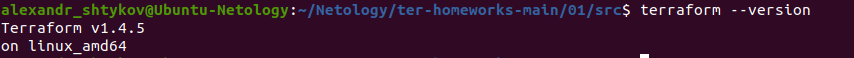

# Домашнее задание к занятию "Введение в Terraform"

### Цель задания

1. Установить и настроить Terrafrom.
2. Научиться использовать готовый код.

------

### Чеклист готовности к домашнему заданию

1. Скачайте и установите актуальную версию **terraform**(не менее 1.3.7). Приложите скриншот вывода команды ```terraform --version```
<p align="center">
  
</p>
2. Скачайте на свой ПК данный git репозиторий. Исходный код для выполнения задания расположен в директории **01/src**.
3. Убедитесь, что в вашей ОС установлен docker

------

### Инструменты и дополнительные материалы, которые пригодятся для выполнения задания

1. Установка и настройка Terraform  [ссылка](https://cloud.yandex.ru/docs/tutorials/infrastructure-management/terraform-quickstart#from-yc-mirror)
2. Зеркало документации Terraform  [ссылка](https://registry.tfpla.net/browse/providers) 
3. Установка docker [ссылка](https://docs.docker.com/engine/install/ubuntu/) 
------

### Задание 1

1. Перейдите в каталог [**src**](https://github.com/netology-code/ter-homeworks/tree/main/01/src). Скачайте все необходимые зависимости, использованные в проекте. 
```
alexandr_shtykov@Ubuntu-Netology:~/Netology/ter-homeworks-main/01/src$ terraform init

Initializing the backend...

Initializing provider plugins...
- Finding kreuzwerker/docker versions matching "~> 3.0.1"...
- Finding latest version of hashicorp/random...
- Installing kreuzwerker/docker v3.0.2...
- Installed kreuzwerker/docker v3.0.2 (unauthenticated)
- Installing hashicorp/random v3.5.1...
- Installed hashicorp/random v3.5.1 (unauthenticated)

Terraform has created a lock file .terraform.lock.hcl to record the provider
selections it made above. Include this file in your version control repository
so that Terraform can guarantee to make the same selections by default when
you run "terraform init" in the future.

╷
│ Warning: Incomplete lock file information for providers
│ 
│ Due to your customized provider installation methods, Terraform was forced to calculate lock file
│ checksums locally for the following providers:
│   - hashicorp/random
│   - kreuzwerker/docker
│ 
│ The current .terraform.lock.hcl file only includes checksums for linux_amd64, so Terraform running on
│ another platform will fail to install these providers.
│ 
│ To calculate additional checksums for another platform, run:
│   terraform providers lock -platform=linux_amd64
│ (where linux_amd64 is the platform to generate)
╵

Terraform has been successfully initialized!

You may now begin working with Terraform. Try running "terraform plan" to see
any changes that are required for your infrastructure. All Terraform commands
should now work.

If you ever set or change modules or backend configuration for Terraform,
rerun this command to reinitialize your working directory. If you forget, other
commands will detect it and remind you to do so if necessary.
```
2. Изучите файл **.gitignore**. В каком terraform файле допустимо сохранить личную, секретную информацию?
```
alexandr_shtykov@Ubuntu-Netology:~/Netology/ter-homeworks-main/01/src$ cat .gitignore 
# Local .terraform directories and files
**/.terraform/*
.terraform*

# .tfstate files
*.tfstate
*.tfstate.*

# own secret vars store.
personal.auto.tfvars

Сохранить личную, секретную информацию допустимо в personal.auto.tfvars
```
3. Выполните код проекта. Найдите  в State-файле секретное содержимое созданного ресурса **random_password**. Пришлите его в качестве ответа.
```
"result": "QhjvBm73dKU60bRu"
```
4. Раскомментируйте блок кода, примерно расположенный на строчках 29-42 файла **main.tf**.
Выполните команду ```terraform validate```. Объясните в чем заключаются намеренно допущенные ошибки? Исправьте их.
```
1) Пропущено имя  ресурса
23: resource "docker_image" { 
All resource blocks must have 2 labels (type, name)

2) Некорректное имя ресурса
28: resource "docker_container" "1nginx" {
A name must start with a letter or underscore and may contain only letters, digits, underscores, and
│ dashes.


Исправленный вариант **main.tf**
...
resource "docker_image" nginx{
  name         = "nginx:latest"
  keep_locally = true
}

resource "docker_container" "nginx1" {
  image = docker_image.nginx.image_id
  name  = "example_${random_password.random_string.result}"

  ports {
    internal = 80
    external = 8000
  }
}
```
5. Выполните код. В качестве ответа приложите вывод команды ```docker ps```
```
alexandr_shtykov@Ubuntu-Netology:~/Netology/ter-homeworks-main/01/src$ docker ps
CONTAINER ID   IMAGE          COMMAND                  CREATED          STATUS         PORTS                  NAMES
71a8b99b55f0   904b8cb13b93   "/docker-entrypoint.…"   11 seconds ago   Up 7 seconds   0.0.0.0:8000->80/tcp   example_QhjvBm73dKU60bRu
```
6. Замените имя docker-контейнера в блоке кода на ```hello_world```, выполните команду ```terraform apply -auto-approve```.
Объясните своими словами, в чем может быть опасность применения ключа  ```-auto-approve``` ? 
```
terraform apply –auto-approve: создает или обновляет инфраструктуру. Этап утверждения пользователем пропускается.
При использовании -auto-approve рекомендуется убедиться, что никто не сможет изменить вашу инфраструктуру за пределами 
вашего рабочего процесса Terraform. Иначе могут произойти непредсказуемые изменения и смещения конфигурации.
```
8. Уничтожьте созданные ресурсы с помощью **terraform**. Убедитесь, что все ресурсы удалены. Приложите содержимое файла **terraform.tfstate**. 
```
alexandr_shtykov@Ubuntu-Netology:~/Netology/ter-homeworks-main/01/src$ cat terraform.tfstate
{
  "version": 4,
  "terraform_version": "1.4.5",
  "serial": 28,
  "lineage": "6f372911-6aef-b3d1-4c40-82f45b5131a4",
  "outputs": {},
  "resources": [],
  "check_results": null
}
```
9. Объясните, почему при этом не был удален docker образ **nginx:latest** ?(Ответ найдите в коде проекта или документации)
```
По причине наличия в коде проекта:
keep_locally = true
```

------

## Дополнительные задания (со звездочкой*)

**Настоятельно рекомендуем выполнять все задания под звёздочкой.**   Их выполнение поможет глубже разобраться в материале.   
Задания под звёздочкой дополнительные (необязательные к выполнению) и никак не повлияют на получение вами зачета по этому домашнему заданию. 

### Задание 2*

1. Изучите в документации provider [**Virtualbox**](https://registry.tfpla.net/providers/shekeriev/virtualbox/latest/docs/overview/index) от 
shekeriev.
2. Создайте с его помощью любую виртуальную машину.

В качестве ответа приложите plan для создаваемого ресурса.

------

### Правила приема работы

Домашняя работа оформляется в отдельном GitHub репозитории в файле README.md.   
Выполненное домашнее задание пришлите ссылкой на .md-файл в вашем репозитории.

### Критерии оценки

Зачёт:

* выполнены все задания;
* ответы даны в развёрнутой форме;
* приложены соответствующие скриншоты и файлы проекта;
* в выполненных заданиях нет противоречий и нарушения логики.

На доработку:

* задание выполнено частично или не выполнено вообще;
* в логике выполнения заданий есть противоречия и существенные недостатки. 
