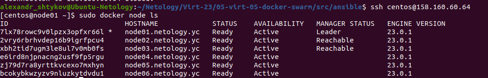
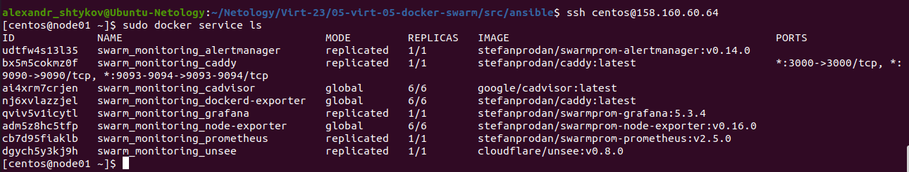

# Домашнее задание к занятию "5. Оркестрация кластером Docker контейнеров на примере Docker Swarm"

## Как сдавать задания

Обязательными к выполнению являются задачи без указания звездочки. Их выполнение необходимо для получения зачета и диплома о профессиональной переподготовке.

Задачи со звездочкой (*) являются дополнительными задачами и/или задачами повышенной сложности. Они не являются обязательными к выполнению, но помогут вам глубже понять тему.

Домашнее задание выполните в файле readme.md в github репозитории. В личном кабинете отправьте на проверку ссылку на .md-файл в вашем репозитории.

Любые вопросы по решению задач задавайте в чате учебной группы.

---


## Важно!

1. Перед отправкой работы на проверку удаляйте неиспользуемые ресурсы.
Это важно для того, чтоб предупредить неконтролируемый расход средств, полученных в результате использования промокода.
Подробные рекомендации [здесь](https://github.com/netology-code/virt-homeworks/blob/virt-11/r/README.md).

2. [Ссылки для установки открытого ПО](https://github.com/netology-code/devops-materials/blob/master/README.md)

---

## Задача 1

Дайте письменые ответы на следующие вопросы:

- В чём отличие режимов работы сервисов в Docker Swarm кластере: replication и global?
```
Для реплицируемой службы указывается количество идентичных задач, которые необходимо запустить.
Глобальная служба запускает одну задачу на каждом узле. Заранее заданного количества заданий нет.
Каждый раз, когда добавляется узел в swarm, оркестратор создает задачу, а планировщик назначает задачу новому узлу.
```
- Какой алгоритм выбора лидера используется в Docker Swarm кластере?
```
Используется алгоритм Raft: если обычный узел долго не получает сообщений от лидера, то он переходит в состояние 
«кандидат» и посылает другим узлам запрос на голосование. Другие узлы голосуют за того кандидата, от которого они 
получили первый запрос. Если кандидат получает сообщение от лидера, то он снимает свою кандидатуру и возвращается 
в обычное состояние. Если кандидат получает большинство голосов, то он становится лидером. Если же он не получил 
большинства, то кандидат ждёт случайное время и инициирует новую процедуру голосования.
Процедура голосования повторяется, пока не будет выбран лидер.
```
- Что такое Overlay Network?
```
Overlay Network в контексте docker является распределенной сетью между несколькими узлами docker.
Эта сеть находится поверх (перекрывает) сети, специфичные для хоста, позволяя контейнерам, подключенным к ней 
(включая контейнеры службы swarm), безопасно обмениваться данными при включенном шифровании.
```

## Задача 2

Создать ваш первый Docker Swarm кластер в Яндекс.Облаке

Для получения зачета, вам необходимо предоставить скриншот из терминала (консоли), с выводом команды:
```
docker node ls
```
<p align="center">
  
</p>

## Задача 3

Создать ваш первый, готовый к боевой эксплуатации кластер мониторинга, состоящий из стека микросервисов.

Для получения зачета, вам необходимо предоставить скриншот из терминала (консоли), с выводом команды:
```
docker service ls
```

<p align="center">
  
</p>

## Задача 4 (*)

Выполнить на лидере Docker Swarm кластера команду (указанную ниже) и дать письменное описание её функционала, что она делает и зачем она нужна:
```
# см.документацию: https://docs.docker.com/engine/swarm/swarm_manager_locking/
docker swarm update --autolock=true
```
<p align="center">
  
</p>

```
Команда включает функцию автоблокировки и заставит вводить ключ разблокировки после перезапуска менеджеров.
Используется для защиты от несанкционированного доступа к конфигурации и даннымм сервисов.
```