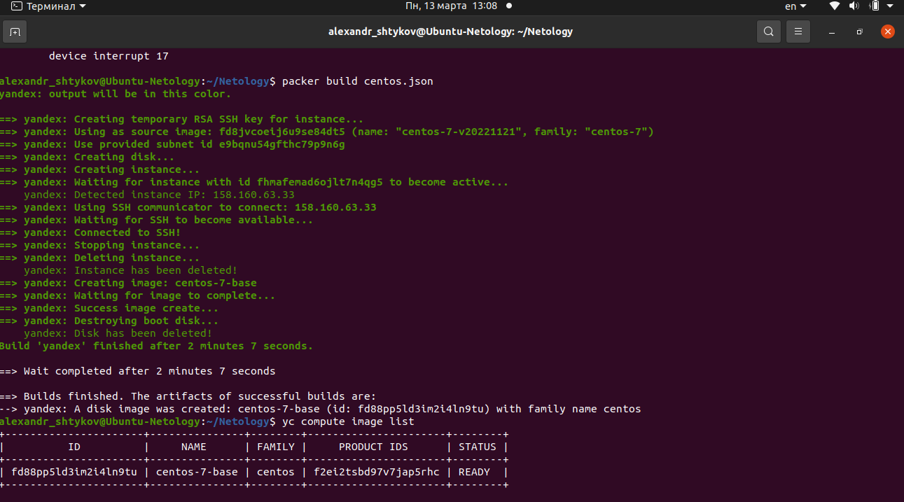
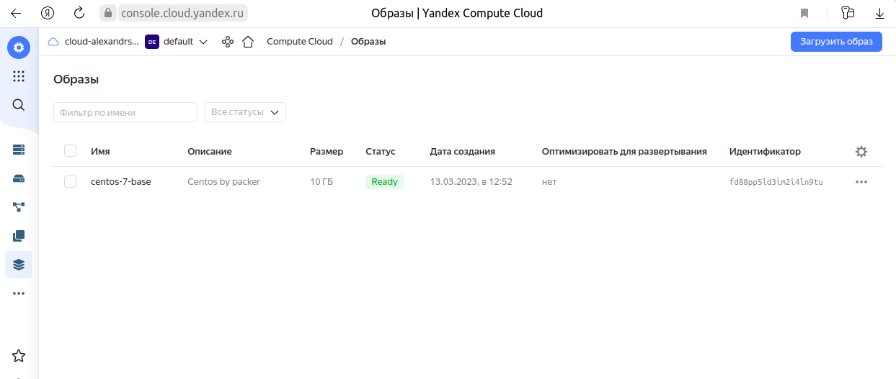
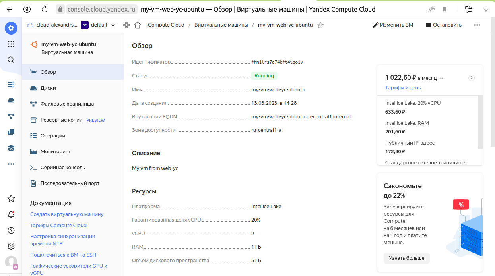
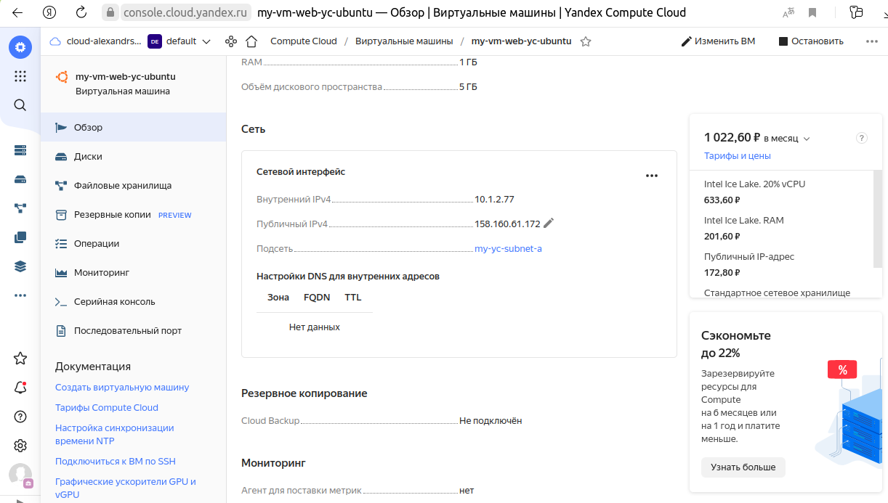
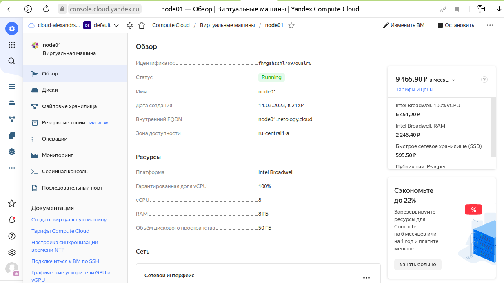
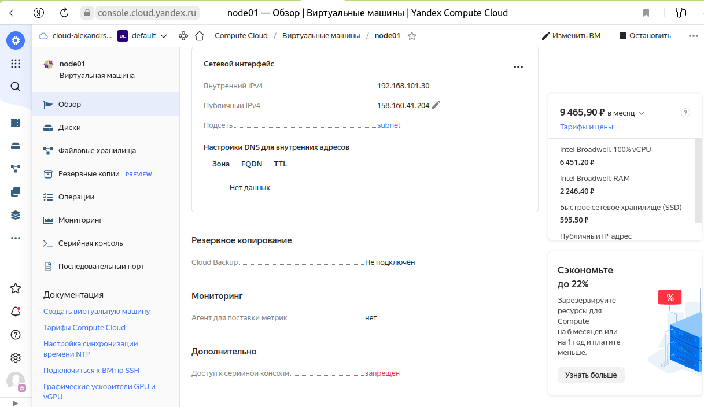
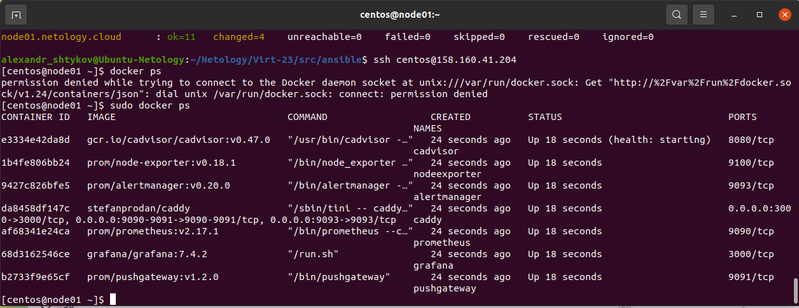
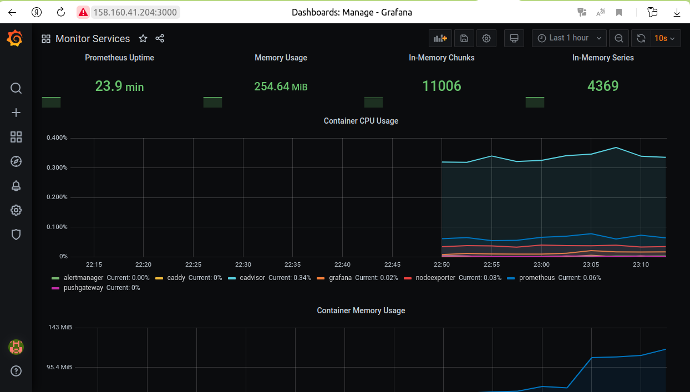

# Домашнее задание к занятию "4. Оркестрация группой Docker контейнеров на примере Docker Compose"

## Как сдавать задания

Обязательными к выполнению являются задачи без указания звездочки. Их выполнение необходимо для получения зачета и диплома о профессиональной переподготовке.

Задачи со звездочкой (*) являются дополнительными задачами и/или задачами повышенной сложности. Они не являются обязательными к выполнению, но помогут вам глубже понять тему.

Домашнее задание выполните в файле readme.md в github репозитории. В личном кабинете отправьте на проверку ссылку на .md-файл в вашем репозитории.

Любые вопросы по решению задач задавайте в чате учебной группы.

---

## Важно!

Перед отправкой работы на проверку удаляйте неиспользуемые ресурсы.
Это важно для того, чтоб предупредить неконтролируемый расход средств, полученных в результате использования промокода.

Подробные рекомендации [здесь](https://github.com/netology-code/virt-homeworks/blob/virt-11/r/README.md)

---

## Задача 1

Создать собственный образ  любой операционной системы (например, ubuntu-20.04) с помощью Packer ([инструкция](https://cloud.yandex.ru/docs/tutorials/infrastructure-management/packer-quickstart))

Для получения зачета вам необходимо предоставить скриншот страницы с созданным образом из личного кабинета YandexCloud.

  
  

## Задача 2

**2.1** Создать вашу первую виртуальную машину в YandexCloud с помощью web-интерфейса YandexCloud.        

  
  

**2.2*** **(Необязательное задание)**      
Создать вашу первую виртуальную машину в YandexCloud с помощью terraform (вместо использования веб-интерфейса YandexCloud).
Используйте terraform код в директории ([src/terraform](https://github.com/netology-group/virt-homeworks/tree/virt-11/05-virt-04-docker-compose/src/terraform))

Для получения зачета, вам необходимо предоставить вывод команды terraform apply и страницы свойств созданной ВМ из личного кабинета YandexCloud.

### Решение:

#### Вывод terraform aplly:
alexandr_shtykov@Ubuntu-Netology:~/Netology/Virt-23/src/terraform_5.4_3$ terraform apply
yandex_vpc_network.default: Refreshing state... [id=enp80k99b6ur0si7kbdd]
yandex_vpc_subnet.default: Refreshing state... [id=e9b9g13grulg11v5es86]

Terraform used the selected providers to generate the following execution plan.
Resource actions are indicated with the following symbols:
  + create

Terraform will perform the following actions:

  # yandex_compute_instance.node01 will be created
  + resource "yandex_compute_instance" "node01" {
      + allow_stopping_for_update = true
      + created_at                = (known after apply)
      + folder_id                 = (known after apply)
      + fqdn                      = (known after apply)
      + hostname                  = "node01.netology.cloud"
      + id                        = (known after apply)
      + metadata                  = {
          + "ssh-keys" = <<-EOT
                centos:ssh-rsa AAAAB3NzaC1yc2EAAAADAQABAAABgQDOUl2fo8iT6TQRiZIF0EYgtd6uHu54HYCTLrhuACc3+hnyMfxzRQUFig5N2JOwp0AzYHnvaMtCZnFRkuyksAOyKCywMfu1XUciyuggL03mIXVJqj4cQ8Vo8taNMqU3RiHaI4hqkiIboj5f4dv627y74WpGfPkZksodSFQhvFxW9HER/+SKsMpKTnO8lssCqohYRi/+0qkxxXhjBPBg3ZUhitYBWs9SWofU55MxPqmFJ1mWB3vAxZ5KJRD5rTLGyj8aA9/qgLIzFFM+fi04jrpJ18FJD0yPvKBKI8eIiAS+LBRbXbA3KdumCUWGBDDdQsCO0VtpKjMmiDkyw7Td6zd81ChXIFTPtSBRY5dYUbK1skmZ6o7BDVuc8t64VpYDvCxgD5cNOvB974/Nl+oZY6itd8ZU/wEgl8BGxtqCHyhn14oc07rfzaPsY1L08AvUH2tIdBeoQm26Wm0I0zhR8G4GNFOazLViK2j0PR+Asp3q0CxfjqFVDdBhjE8lz4XsMn0= alexandr_shtykov@Ubuntu-Netology
            EOT
        }
      + name                      = "node01"
      + network_acceleration_type = "standard"
      + platform_id               = "standard-v1"
      + service_account_id        = (known after apply)
      + status                    = (known after apply)
      + zone                      = "ru-central1-a"

      + boot_disk {
          + auto_delete = true
          + device_name = (known after apply)
          + disk_id     = (known after apply)
          + mode        = (known after apply)

          + initialize_params {
              + block_size  = (known after apply)
              + description = (known after apply)
              + image_id    = "fd8qrcu77bshtp645mns"
              + name        = "root-node01"
              + size        = 50
              + snapshot_id = (known after apply)
              + type        = "network-nvme"
            }
        }

      + network_interface {
          + index              = (known after apply)
          + ip_address         = (known after apply)
          + ipv4               = true
          + ipv6               = (known after apply)
          + ipv6_address       = (known after apply)
          + mac_address        = (known after apply)
          + nat                = true
          + nat_ip_address     = (known after apply)
          + nat_ip_version     = (known after apply)
          + security_group_ids = (known after apply)
          + subnet_id          = "e9b9g13grulg11v5es86"
        }

      + resources {
          + core_fraction = 100
          + cores         = 8
          + memory        = 8
        }
    }

Plan: 1 to add, 0 to change, 0 to destroy.

Changes to Outputs:
  + external_ip_address_node01_yandex_cloud = (known after apply)
  + internal_ip_address_node01_yandex_cloud = (known after apply)

Do you want to perform these actions?
  Terraform will perform the actions described above.
  Only 'yes' will be accepted to approve.

  Enter a value: yes

yandex_compute_instance.node01: Creating...
yandex_compute_instance.node01: Still creating... [10s elapsed]
yandex_compute_instance.node01: Still creating... [20s elapsed]
yandex_compute_instance.node01: Still creating... [30s elapsed]
yandex_compute_instance.node01: Creation complete after 39s [id=fhmgahsshl7o97oualr6]

Apply complete! Resources: 1 added, 0 changed, 0 destroyed.

Outputs:

external_ip_address_node01_yandex_cloud = "158.160.41.204"
internal_ip_address_node01_yandex_cloud = "192.168.101.30"

  
  

## Задача 3

С помощью ansible и docker-compose разверните на виртуальной машине из предыдущего задания систему мониторинга на основе Prometheus/Grafana .
Используйте ansible код в директории ([src/ansible](https://github.com/netology-group/virt-homeworks/tree/virt-11/05-virt-04-docker-compose/src/ansible))

Для получения зачета вам необходимо предоставить вывод команды "docker ps" , все контейнеры, описанные в ([docker-compose](https://github.com/netology-group/virt-homeworks/blob/virt-11/05-virt-04-docker-compose/src/ansible/stack/docker-compose.yaml)),  должны быть в статусе "Up".

  

## Задача 4

1. Откройте веб-браузер, зайдите на страницу http://<внешний_ip_адрес_вашей_ВМ>:3000.
2. Используйте для авторизации логин и пароль из ([.env-file](https://github.com/netology-group/virt-homeworks/blob/virt-11/05-virt-04-docker-compose/src/ansible/stack/.env)).
3. Изучите доступный интерфейс, найдите в интерфейсе автоматически созданные docker-compose панели с графиками([dashboards](https://grafana.com/docs/grafana/latest/dashboards/use-dashboards/)).
4. Подождите 5-10 минут, чтобы система мониторинга успела накопить данные.

Для получения зачета, вам необходимо предоставить: 
- Скриншот работающего веб-интерфейса Grafana с текущими метриками, как на примере ниже

  

  

## Задача 5 (*)

Создать вторую ВМ и подключить её к мониторингу развёрнутому на первом сервере.

Для получения зачета, вам необходимо предоставить:
- Скриншот из Grafana, на котором будут отображаться метрики добавленного вами сервера.